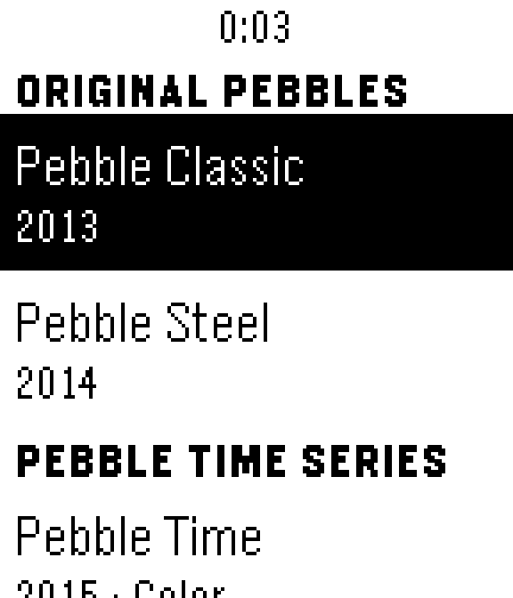
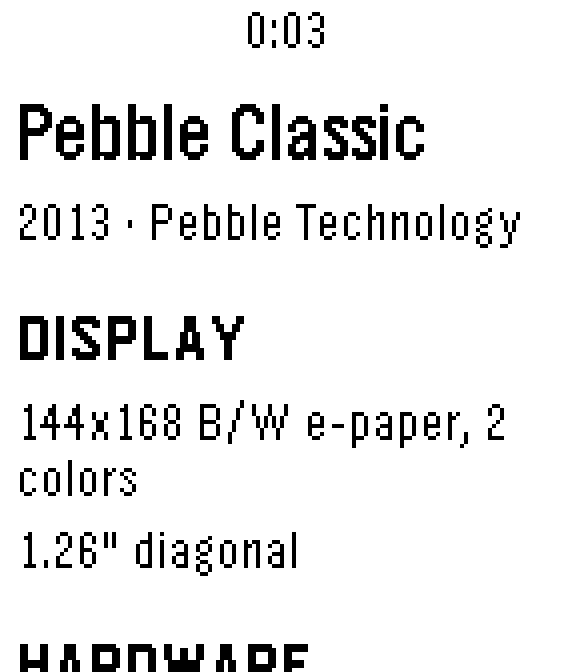
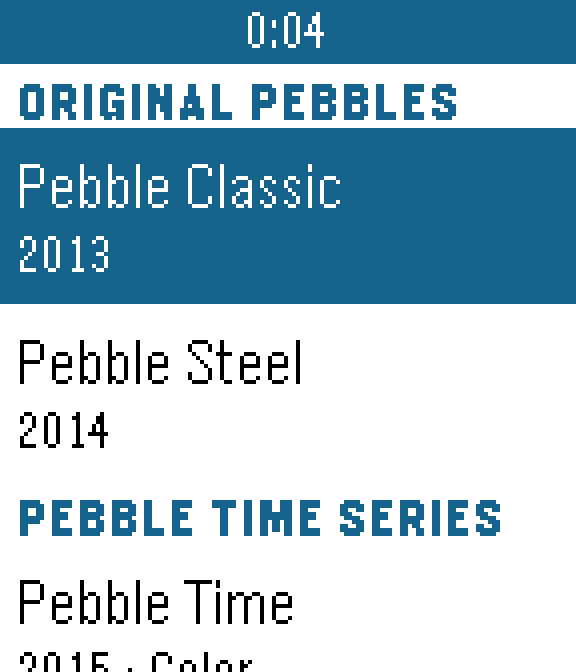
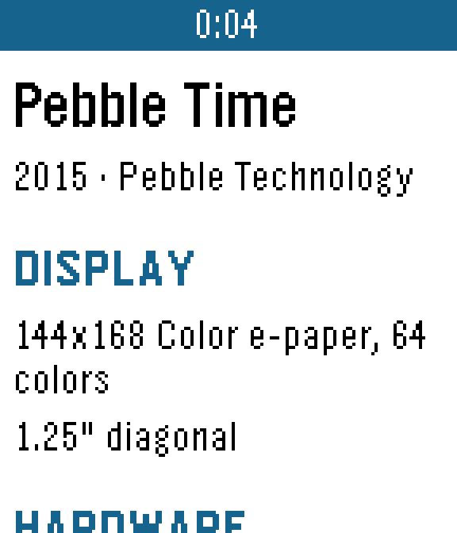
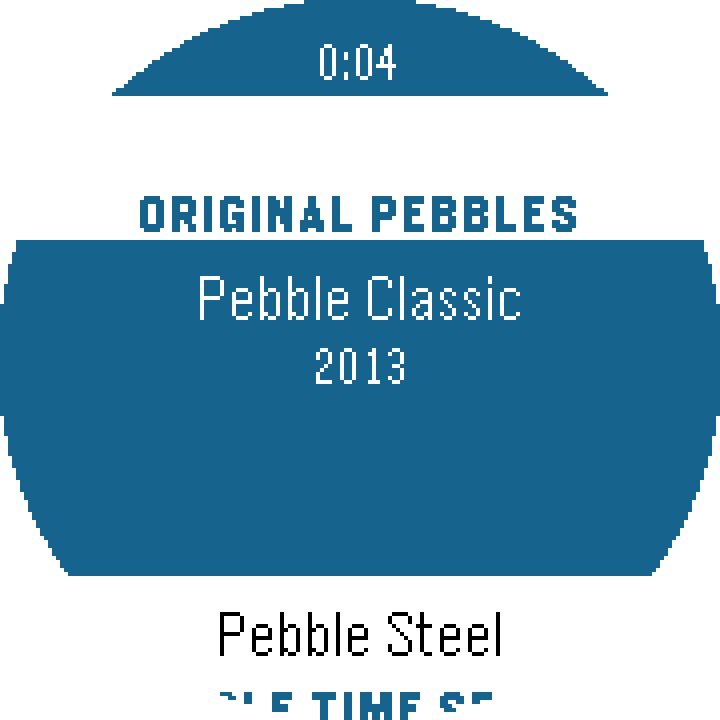
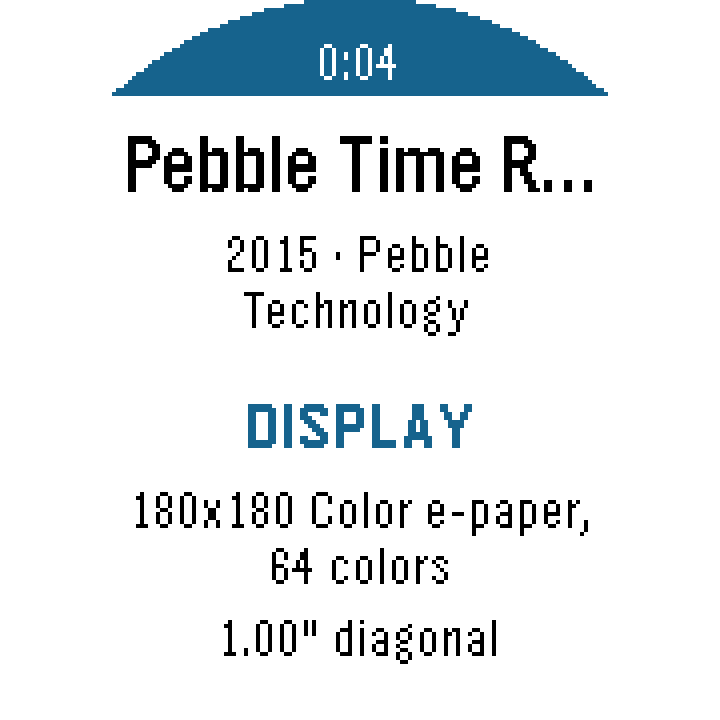
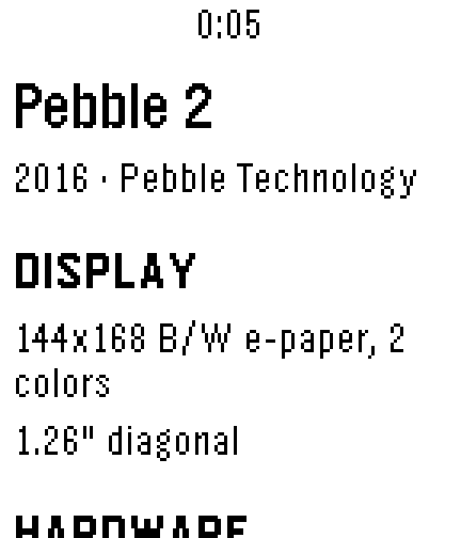
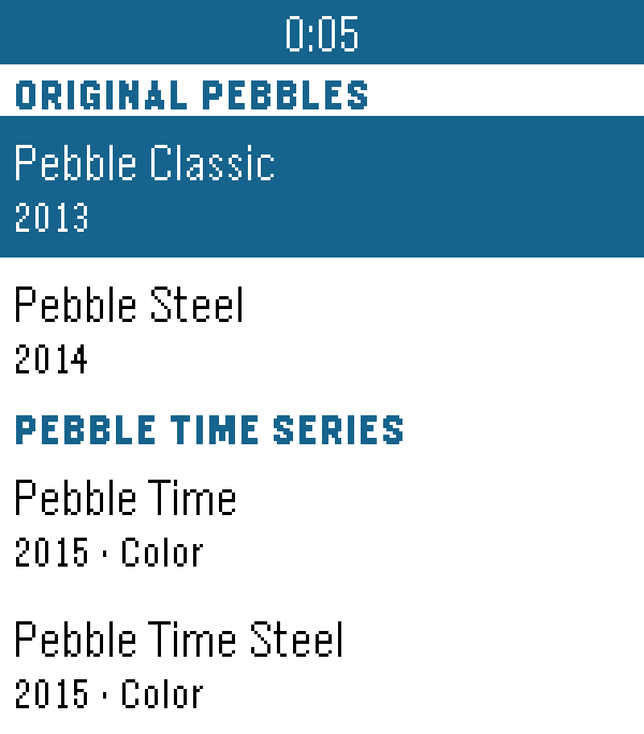
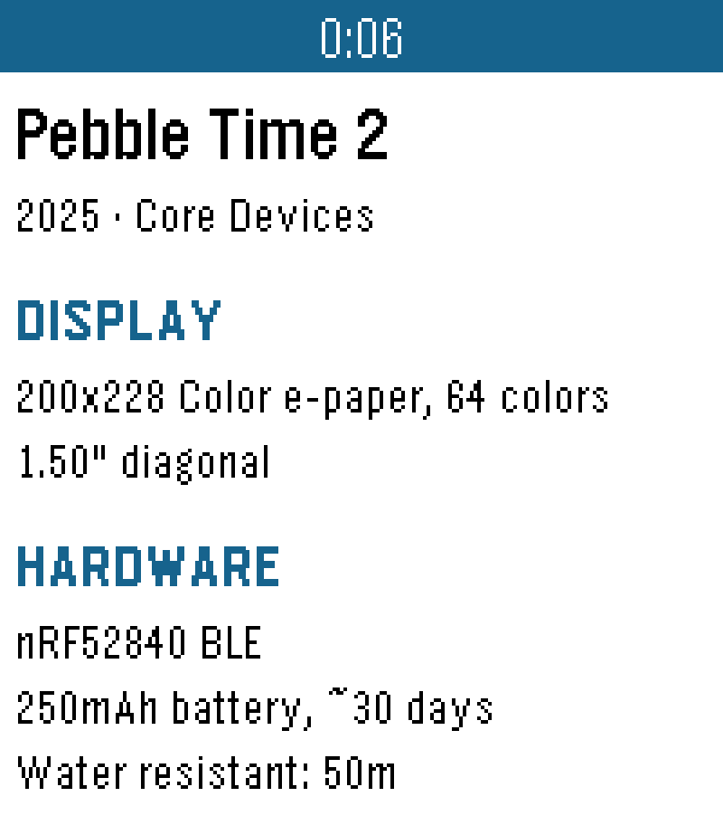
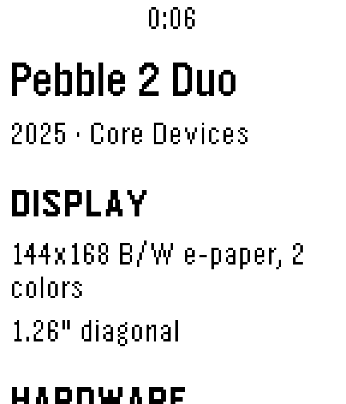

# Pebbletracker

A Pebble watchapp that catalogs all Pebble devices ever made, inspired by Mactracker.

## Features

- **13 devices** across 6 categories
- Detailed specs: display, processor, battery, sensors, body, price
- Works on all Pebble platforms

## Devices

| Category | Devices |
|----------|---------|
| Original Pebbles | Classic, Steel |
| Pebble Time Series | Time, Time Steel, Time Round |
| Pebble 2 Series | Pebble 2, Pebble 2 SE |
| Core Watches | 2 Duo, Time 2, Round 2 |
| Other Devices | Index 01 |
| Cancelled | Pebble Time 2 (2016), Pebble Core |

## Screenshots

### aplite (Pebble Classic/Steel)
| List | Detail |
|------|--------|
|  |  |

### basalt (Pebble Time)
| List | Detail |
|------|--------|
|  |  |

### chalk (Pebble Time Round)
| List | Detail |
|------|--------|
|  |  |

### diorite (Pebble 2)
| List | Detail |
|------|--------|
|  |  |

### emery (Pebble Time 2)
| List | Detail |
|------|--------|
|  |  |

### flint (Pebble 2 Duo)
| List | Detail |
|------|--------|
|  |  |

## Build

```bash
pebble build
pebble install --emulator basalt
```

## License

MIT
